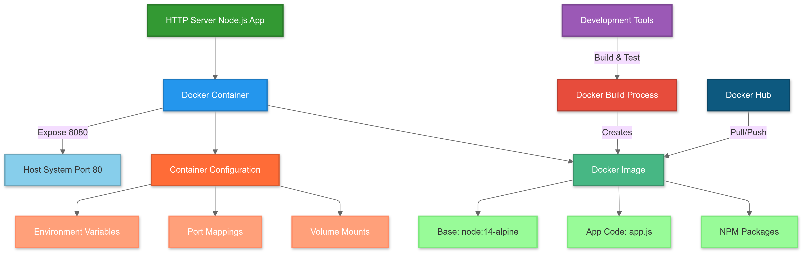

# 🚀 ContainerCraft: Mastering Node.js Containerization

<p align="center">
  
</p>

<div align="center">

[](https://github.com/TheToriqul/single-container-app)
[](https://nodejs.org/)
[](https://www.docker.com/)
[](https://www.alpinelinux.org/)
[](https://devops.com/)

</div>

## 📋 Project Overview

ContainerCraft is my advanced implementation showcasing the art of containerizing Node.js applications using Docker. This project demonstrates my expertise in creating efficient, secure, and production-ready containerized applications. Through this hands-on development, I've mastered crucial DevOps practices and modern containerization techniques that ensure seamless deployment across any environment.

## 🎯 Key Objectives

- Master production-grade containerization techniques for Node.js applications
- Implement advanced Docker optimization strategies including layer caching and multi-stage builds
- Establish robust security protocols through proper container configuration
- Design efficient networking and port mapping solutions
- Create scalable and maintainable container management workflows

## 🏗️ Project Architecture
The project implements a containerized Node.js HTTP server using Docker, where the application runs inside a container built on the lightweight node:14-alpine base image. The container exposes port 8080 internally which is mapped to port 80 on the host system, while the Docker image layers efficiently organize the base image, application code (app.js), and required Node.js dependencies for consistent deployment across any environment.

<figure >
  <p align="center">
      
      <p align="center">ContainerCraft: Docker Container Architecture and Workflow</p> 
  </p>
</figure>

## 💻 Technical Stack

<div align="left">

| Category | Technology |
|----------|------------|
| Runtime Environment | Node.js on Alpine Linux |
| Containerization | Docker Engine |
| Base Image | node:14-alpine |
| Application | HTTP Server |
| Port Configuration | Container: 8080, Host: 80 |
| Security | Docker Security Scanning, Minimal Base Image |

</div>

## 🚀 Getting Started

<details>
<summary>🐳 Prerequisites</summary>

- Docker Engine (latest version)
- Node.js (for local development)
- Git for version control
- Docker Hub account (optional)

</details>

<details>
<summary>⚙️ Installation</summary>

1. Clone the repository:
   ```bash
   git clone https://github.com/TheToriqul/single-container-app.git
   ```
2. Navigate to the project directory:
   ```bash
   cd single-container-app
   ```
3. Build the Docker image:
   ```bash
   docker build -t my-node-app:1.0 .
   ```

</details>

<details>
<summary>🎮 Usage</summary>

1. Run the container:
   ```bash
   docker run -d --name my-node-app-container -p 80:8080 my-node-app:1.0
   ```
2. Access the application:
   ```bash
   curl http://localhost:80
   ```

For detailed commands and operations, refer to the [reference-commands.md](reference-commands.md) file.

</details>

## 💡 Key Learnings

### Technical Mastery:

1. Advanced Docker image optimization techniques
2. Container layer management and caching strategies
3. Security-first container configuration
4. Efficient networking and port mapping
5. Production deployment best practices

### Professional Development:

1. Modern DevOps methodologies
2. Security-focused application packaging
3. Efficient containerization workflows
4. Container orchestration fundamentals
5. Technical documentation expertise

### 🔄 Future Enhancements

<details>
<summary>View Planned Improvements</summary>

1. Implement container health monitoring system
2. Add automated CI/CD pipeline
3. Integrate security scanning in build process
4. Enhanced logging and monitoring
5. Kubernetes deployment configuration
6. Automated testing framework

</details>

## 🙌 Contribution

Your contributions are welcome! Please feel free to submit:
- [Issues](https://github.com/TheToriqul/single-container-app/issues)
- [Pull Requests](https://github.com/TheToriqul/single-container-app/pulls)
- [Feature Suggestions](https://github.com/TheToriqul/single-container-app/issues/new)

## 📧 Connect with Me

<div align="left">

| Platform | Link |
|----------|------|
| 📧 Email | toriqul.int@gmail.com |
| 📱 Phone | +65 8936 7705, +8801765 939006 |
| 🌐 LinkedIn | [@TheToriqul](https://www.linkedin.com/in/thetoriqul/) |
| 🐙 GitHub | [@TheToriqul](https://github.com/TheToriqul) |
| 🌍 Portfolio | [TheToriqul.com](https://thetoriqul.com) |

</div>

## 👏 Acknowledgments

- [Poridhi for providing comprehensive labs and inspiring this project](https://devops.poridhi.io/)
- Docker community for extensive documentation and support
- Node.js community for robust runtime environment
- Alpine Linux team for secure, lightweight base images

---

<div align="center">

**[⬆ Back to Top](#-containercraft-mastering-nodejs-containerization)**

Thank you for exploring ContainerCraft! Let's connect and discuss containerization and DevOps! 🚀

</div>